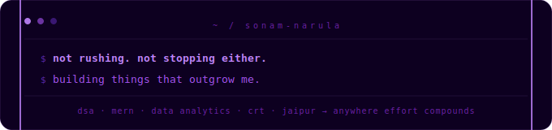

<br clear="both">

<div align="center">

[](https://github.com/SonamNarula)

<br/>

<a href="https://github.com/SonamNarula">
  
</a>

</div>

---
<div align="center">
  
</div>

## 💫 About Me

👋 Hey! I'm **Sonam Narula** — a CSE undergrad from **JECRC University, Jaipur** who shows up every single day.<br/>
💻 I build full-stack products with the **MERN stack** — real apps, real users, real problems solved.<br/>
⚔️ **DSA in C++** is my daily grind — 485+ LeetCode problems and still going.<br/>
🏢 Currently **SPC Intern @ JECRC** — shortlisted and building.<br/>
🎯 Actively targeting an **on-site internship** in Bangalore or Hyderabad.<br/>
🔥 Streaks don't die. Commits don't lie. GitHub stays green.<br/>

---

## 🚀 Featured Project

<div align="center">

### 💜 [Trackify — Student Productivity Suite](https://trackify.wasmer.app)

> *A full-featured student dashboard — track DSA solves, study hours, tasks, deadlines & more. Built & deployed.*

[](https://trackify.wasmer.app)

</div>

---

## 🏆 Achievements

```bash
## 🏆 Highlights  

- SPC Intern @ JECRC University  
- 485+ LeetCode problems solved  
- Daily practice on GeeksForGeeks  
- Projects based on what I learned till now: NeuroNews, Nike Store, Trackify  
- Target: On-site Internship 2026  
```

---


## 🛠️ Tech Arsenal

<div align="center">

**💻 Languages**


<br/><br/>

**⚛️ Frontend**


<br/><br/>

**🖥️ Backend & Database**


<br/><br/>

**⚙️ Tools & DevOps**


<br/><br/>

**🤖 AI & Others**


</div>


---

## 🚀 Projects That Hit Different  

> built with what I know. improving with what I learn next.

```bash
$ ls ~/projects/shipped

┌───────────────────┬──────────────────────────────────────────────┬──────────────┐
│ PROJECT           │ DESCRIPTION                                  │ STACK        │
├───────────────────┼──────────────────────────────────────────────┼──────────────┤
│ Trackify 💜       │ Student productivity system                  │ React · TS   │
│ [LIVE]            │ DSA tracking · study hours · task manager    │ Vite · JS    │
├───────────────────┼──────────────────────────────────────────────┼──────────────┤
│ NeuroNews         │ Real-time news platform                      │ React · JS   │
│                   │ infinite scroll · filters · REST API         │              │
├───────────────────┼──────────────────────────────────────────────┼──────────────┤
│ Nike Store        │ E-commerce frontend                          │ React · JS   │
│                   │ product pages · cart · state logic           │              │
├───────────────────┼──────────────────────────────────────────────┼──────────────┤
│ SwiftMind         │ AI chat interface                            │ React · JS   │
│                   │ minimal UI · API integration                 │              │
├───────────────────┼──────────────────────────────────────────────┼──────────────┤
│ UI Clones         │ Pixel-perfect UI recreations                 │ HTML · CSS   │
│                   │ layout · responsiveness                      │ JS           │
└───────────────────┴──────────────────────────────────────────────┴──────────────┘
```

---

## 📊 GitHub Stats

<br/>

<div align="center">


</div>

---

## ⚔️ DSA Grind

<div align="center">


<br/><br/>

[](https://leetcode.com/u/sonamnarula2005/)
[](https://www.geeksforgeeks.org/profile/sonammnapaqc)
[](https://codolio.com/profile/0PG2lf5S)

</div>

---

## 🐍 Contribution Snake

<picture>
  <source media="(prefers-color-scheme: dark)" srcset="https://raw.githubusercontent.com/krishrathi1/krishrathi1/output/pacman-contribution-graph-dark.svg">
  <source media="(prefers-color-scheme: light)" srcset="https://raw.githubusercontent.com/krishrathi1/krishrathi1/output/pacman-contribution-graph.svg">
  
</picture>

<picture>
  <source media="(prefers-color-scheme: dark)" srcset="https://raw.githubusercontent.com/SonamNarula/SonamNarula/output/github-snake-dark.svg" />
  <source media="(prefers-color-scheme: light)" srcset="https://raw.githubusercontent.com/SonamNarula/SonamNarula/output/github-snake.svg" />
  
</picture>

<br/>

[](https://github.com/SonamNarula)

---

## 📡 Find Me

<div align="center">

<div align="center">
<a href="https://www.linkedin.com/in/sonam-narula-402a60285/">
  
</a>
&nbsp;
<a href="https://github.com/SonamNarula">
  
</a>
&nbsp;
<a href="mailto:sonamnarula2108@gmail.com">
  
</a>
<a href="https://codolio.com/profile/0PG2lf5S">
  
</a>
</div>


</div>

---


