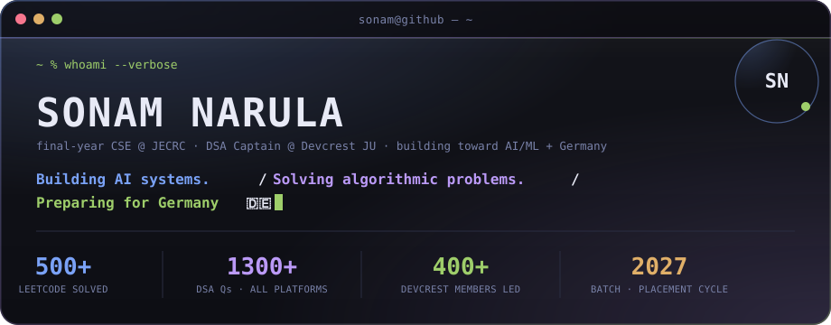
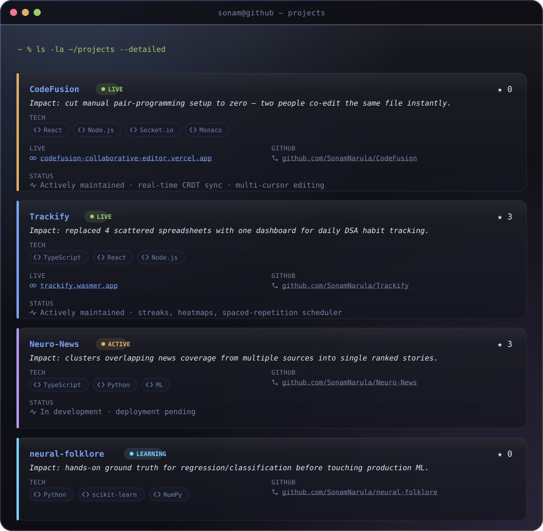
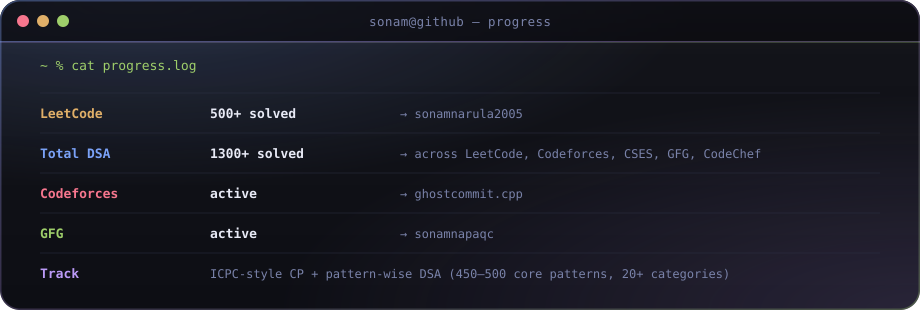
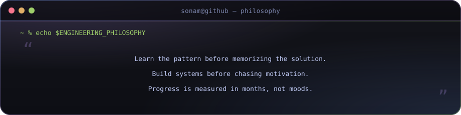
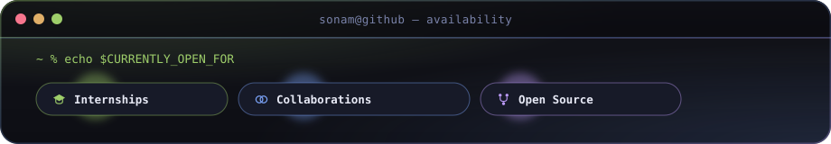

  

  

  

 

<h3><code>sonam@github ~ % whoami --verbose</code></h3>

  

<h3><code>sonam@github ~ % cat stack.txt</code></h3>

  
<h3><code>sonam@github ~ % ls -la ~/projects --detailed</code></h3>

  
<h3><code>sonam@github ~ % cat roadmap.md</code></h3>

  
<h3><code>sonam@github ~ % ./contributions.sh</code></h3>

  
<h3><code>sonam@github ~ % stats --year --live</code></h3>
<!-- STATS:START -->

<!-- STATS:END -->

 

<h3><code>sonam@github ~ % cat progress.log</code></h3>

  
<h3><code>sonam@github ~ % echo $ENGINEERING_PHILOSOPHY</code></h3>

 

<h3><code>sonam@github ~ % echo $CURRENTLY_OPEN_FOR</code></h3>

  
<h3><code>sonam@github ~ % echo $CONNECT</code></h3>

  

  
© Sonam Narula · last manual edit tracked via git history

