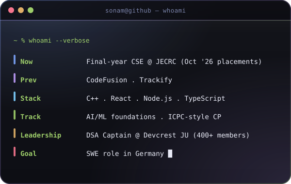
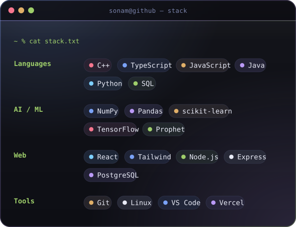
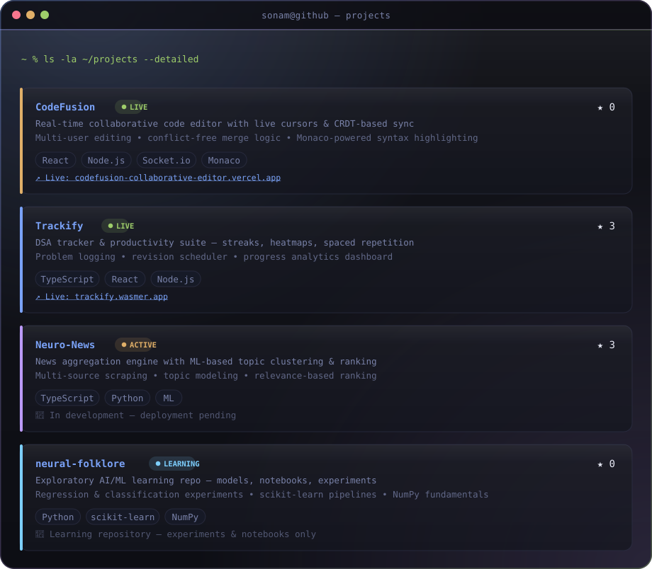
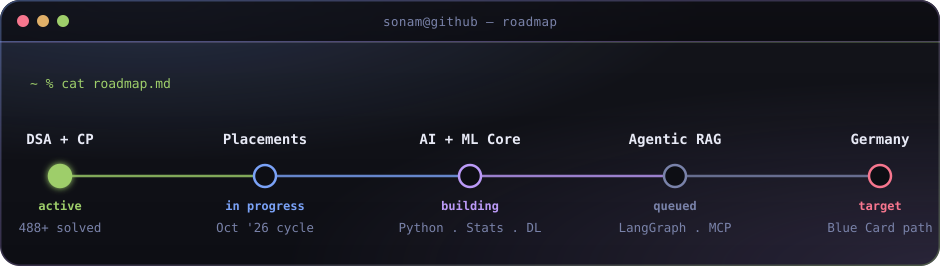
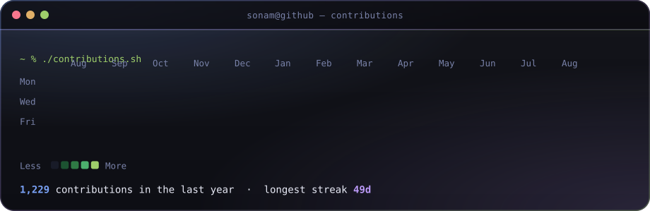
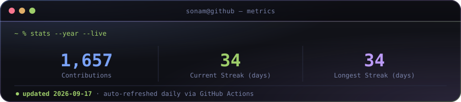

<div align="center">


<br><br>


<br><br>

<a href="mailto:sonamnarula2108@gmail.com"></a>
<a href="https://www.linkedin.com/in/sonamnarula"></a>
<a href="https://codolio.com/profile/0PG2lf5S"></a>
<a href="https://linktr.ee/SonamNarula"></a>

</div>

<br>

<div align="center">

<h3><code>sonam@github ~ % whoami --verbose</code></h3>


<br><br>

<h3><code>sonam@github ~ % cat stack.txt</code></h3>


<br><br>

<h3><code>sonam@github ~ % ls -la ~/projects --detailed</code></h3>


<br><br>

<h3><code>sonam@github ~ % cat roadmap.md</code></h3>


<br><br>

<h3><code>sonam@github ~ % ./contributions.sh</code></h3>


<br><br>

<h3><code>sonam@github ~ % stats --year --live</code></h3>

<!-- STATS:START -->

<!-- STATS:END -->

</div>

<br>

<div align="center">

### `sonam@github ~ %` cat progress.log

</div>

```yaml
LeetCode    : 500+ solved       → sonamnarula2005
Total DSA   : 1300+ solved      → across LeetCode, Codeforces, CSES, GFG, CodeChef
Codeforces  : active           → ghostcommit.cpp
GFG         : active           → sonammnapaqc
Track       : ICPC-style CP + pattern-wise DSA (450–500 core patterns, 20+ categories)
```

<br>

<div align="center">

### `sonam@github ~ %` echo $ENGINEERING_PHILOSOPHY

```
consistency compounds — 200+ day streaks aren't motivation, they're infrastructure.
solve the pattern, not the problem. debug the fundamentals, not the symptom.
ship it, measure it, then make it smarter.
```

</div>

<br>

<div align="center">

### `sonam@github ~ %` echo $CONNECT

<a href="mailto:sonamnarula2108@gmail.com"></a>
<a href="https://www.linkedin.com/in/sonamnarula"></a>
<a href="https://codolio.com/profile/0PG2lf5S"></a>
<a href="https://linktr.ee/SonamNarula"></a>

<br><br>


<br><br>

<sub>© Sonam Narula · last manual edit tracked via git history</sub>

</div>
