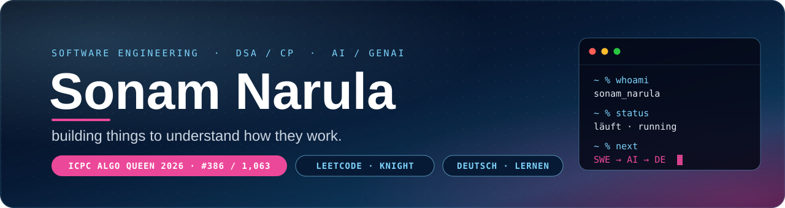
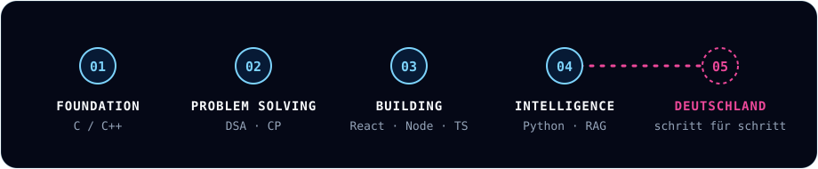

<div align="center">



<br>

<a href="https://github.com/SonamNarula"></a>
<a href="https://in.linkedin.com/in/sonamnarula"></a>
<a href="https://leetcode.com/u/sonamnarula2005/"></a>
<a href="mailto:sonamnarula2108@gmail.com"></a>

<br><br>

**[About](#-about) · [Proof](#-proof-of-work) · [Projects](#-projects) · [Stack](#-stack) · [Route](#-route-to-deutschland)**

</div>

<br>

## 👋 About

I'm a final-year CS student at JECRC University, Jaipur (class of 2027). I started with C and C++, fell properly into DSA and competitive programming, and then got curious about what sits *behind* an AI app: how information is represented, retrieved and grounded. That curiosity is what the Python and RAG work is about.

I learn by building. A tutorial tells me what something does; a project makes me understand why it works; debugging shows me where it breaks.

> **I don't want to just use technology. I want to understand enough to build with it.**

```text
question → learn → build → break → debug → understand → build better
```

<sub>🇩🇪 *Nicht nur benutzen. Verstehen.*</sub>

<br>

<div align="center">

| **#386 / 1,063** | **5 / 6** | **1,450+** | **400+** |
|:---:|:---:|:---:|:---:|
| ICPC Algo Queen 2026<br>global rank | problems solved<br>in that contest | DSA / CP problems<br>across platforms | members led as<br>DSA Captain, Devcrest JU |



</div>

<br>

## 🏆 Proof of work

| Platform | Highlight |
|---|---|
| **ICPC Algo Queen 2026** | Global rank **#386 of 1,063**, 5/6 solved. International, ICPC Foundation-endorsed. |
| **LeetCode** | Knight tier, top 0.5% worldwide. 500-day badge. |
| **LeetCode Biweekly** | All-Kill, every problem cleared. ~Rank 155 of 36,465. |
| **AtCoder** | Debut rank 92 / 10,763 (7/7 solved). Rank 1 among Indian participants in ABC465. 791 rating (Brown). |

If I could show only one contest it would be ICPC Algo Queen: one clock, no retries, months of prep squeezed into a single sitting.

<div align="center">

<br>



<br>

<picture>
  <source media="(prefers-color-scheme: dark)" srcset="dist/snake-dark.svg">
  
</picture>

<sub>Both of these are generated by GitHub Actions and refresh daily.</sub>

</div>

<br>

## 🚀 Projects

<table>
<tr>
<td width="50%" valign="top">

### ⚡ [CodeFusion](https://github.com/SonamNarula/CodeFusion-a-collaborative-real-time-code-editor)
**Real-time collaborative code editor**

Two people can type on the same line and neither loses a keystroke. Sync runs on **Yjs CRDTs**, so it works offline and merges on reconnect. On top: shared code execution, an in-room AI pair-programmer, session replay and an interview mode.

`React` `Node.js` `Yjs` `Monaco` `Docker`

[**Live demo**](https://codefusion-collaborative-editor.vercel.app/) · [**Source**](https://github.com/SonamNarula/CodeFusion-a-collaborative-real-time-code-editor)

</td>
<td width="50%" valign="top">

### 🌰 [AcornFolio](https://github.com/SonamNarula/AcornFolio)
**AI mutual-fund co-pilot**

Reasons about Direct vs Regular plans, SIP/SWP/STP, XIRR, tax and exit load. The one decision that mattered: **don't ask the LLM to do the maths.** Numbers stay deterministic in code; the AI layer handles language and retrieval only.

`Next.js` `TypeScript` `Prisma` `LanceDB` `RAG`

[**Source**](https://github.com/SonamNarula/AcornFolio)

</td>
</tr>
<tr>
<td width="50%" valign="top">

### 🧠 [neural-folklore](https://github.com/SonamNarula/neural-folklore)
**AI learning lab**

The messy middle of learning AI: experiments, wrong assumptions, concepts that made no sense at first. The RAG pipeline that started here as exercises later became part of AcornFolio.

`Python` `LLMs` `Embeddings` `Vector search`

[**Source**](https://github.com/SonamNarula/neural-folklore)

</td>
<td width="50%" valign="top">

### 📊 [Trackify](https://github.com/SonamNarula/Trackify-college-minor-project)
**Student productivity dashboard**

DSA progress, study hours and deadlines in one place. Began as a college minor project; the part I like most is that I kept using it long after submission.

`React` `TypeScript` `Vite` `Chart.js`

[**Live app**](https://trackify.wasmer.app) · [**Source**](https://github.com/SonamNarula/Trackify-college-minor-project)

</td>
</tr>
</table>

<sub>Also: [NeuroNews](https://github.com/SonamNarula/Neuro-News), a category-based news reader in React, built for short breaks between DSA sessions.</sub>

<br>

## 🛠️ Stack

<div align="center">

| | |
|:--|:--|
| **Languages** |  |
| **Frontend** |  |
| **Backend and data** |  |
| **Tooling** |  |
| **AI** |     |

**Primary:** C++ &nbsp;·&nbsp; **Building:** Python &nbsp;·&nbsp; **Exploring:** GenAI

</div>

<br>

## 🇩🇪 Route to Deutschland

Germany is a direction I'm working toward on purpose, not a wish:

`fundamentals` → `building` → `AI` → `experience & interviews` → `Deutsch` → `Deutschland`

Learning German runs alongside everything else, built the same way as the rest: small repetitions, then patterns, then fluency.

<div align="center">

```text
status:  IN PROGRESS  ███████████░░░░░
next:    keep building.
```

<sub>**Schritt für Schritt.** One step at a time.</sub>

</div>

<br>

## 🤝 Beyond the code

<div align="center">


</div>

<br>

---

<div align="center">

### If you're building something interesting, let's talk.

<a href="mailto:sonamnarula2108@gmail.com"></a>
<a href="https://in.linkedin.com/in/sonamnarula"></a>

</div>
